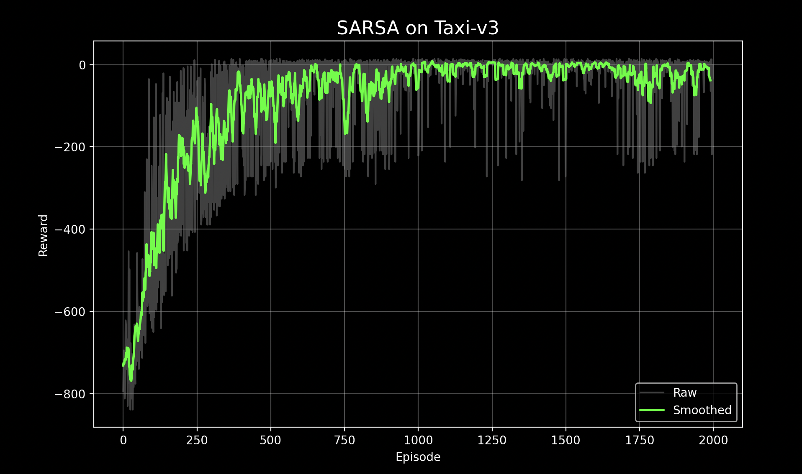
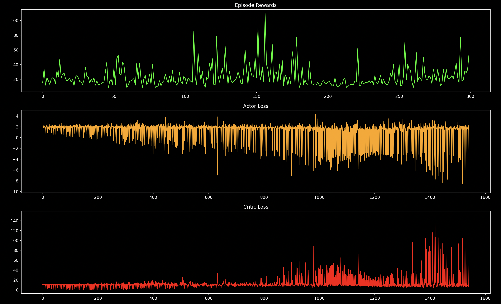
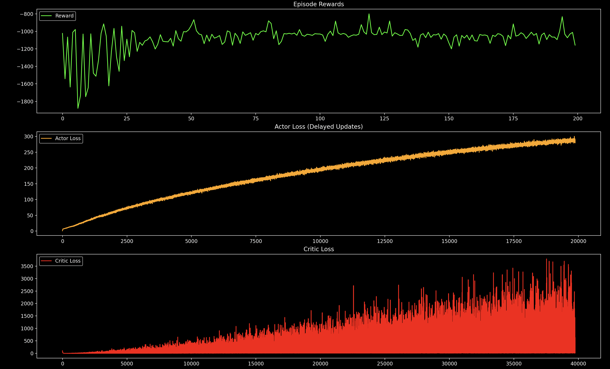

# Reinforcement Learning Algorithms: From Tabular Methods to Advanced Actor–Critic

**A curated, experiment-driven collection of foundational and modern Reinforcement Learning (RL) algorithms implemented from scratch in PyTorch and NumPy, benchmarked across classic control and discrete environments.**

---
## 1. Overview
This repository aggregates implementations spanning value-based, policy-gradient, and deterministic continuous-control paradigms:

Algorithms included:
- Tabular: Q-Learning, SARSA
- Value-Based Deep RL: DQN, Double DQN (DDQN)
- Policy Gradient / Stochastic Actor–Critic: Vanilla Actor-Critic, Advantage Actor-Critic (A2C), Proximal Policy Optimization (PPO)
- Deterministic Actor–Critic for Continuous Control: DDPG, Twin Delayed DDPG (TD3)

Environments used (Gymnasium): FrozenLake-v1, Taxi-v3, CartPole-v1, Pendulum-v1, BipedalWalker-v3 (fallback to Pendulum if Box2D unavailable).

---
## 2. Mathematical Foundations
Below are the core update rules and objectives distinguishing the algorithms.

### 2.1 Tabular Methods
- Q-Learning (off-policy, bootstrapped):
  


- SARSA (on-policy):


### 2.2 Deep Value-Based
- DQN:


- Double DQN:


### 2.3 Policy Gradient & Advantage Actor–Critic
- Policy Objective:  

$$
J(\theta) = \mathbb{E}\Big[\sum_t \gamma^t r_t \Big]
$$

- REINFORCE Gradient:  

$$
\nabla_\theta J = \mathbb{E}\Big[\sum_t \nabla_\theta \log \pi_\theta(a_t|s_t) G_t \Big]
$$

- Actor–Critic Advantage:

$$
A_t = G_t - V(s_t)
$$

- Actor Loss & Critic Loss:  

$$
L_{\text{actor}} = - \log \pi_\theta(a_t|s_t) A_t
$$
$$
L_{\text{critic}} = \big( V(s_t) - G_t \big)^2
$$

- A2C (synchronous multi-step return):  

$$
R_t^{(n)} = \sum_{k=0}^{n-1} \gamma^k r_{t+k} + \gamma^n V(s_{t+n})
$$

---

### 2.4 PPO (Clipped Surrogate)
- Probability Ratio:  

$$
r_t(\theta) = \frac{\pi_\theta(a_t|s_t)}{\pi_{\theta_{\text{old}}}(a_t|s_t)}
$$

- Clipped Surrogate Objective:  

$$
L^{\text{CLIP}} = \mathbb{E} \Big[ \min \big( r_t A_t, \text{clip}(r_t, 1-\epsilon, 1+\epsilon) A_t \big) \Big]
$$

---

### 2.5 Deterministic Actor–Critic (DDPG / TD3)
- Deterministic Policy:  

$$
a = \mu_\theta(s)
$$

- Critic Target:  

$$
y = r + \gamma Q_{\phi'}(s', \mu_{\theta'}(s'))
$$

- Actor Gradient:  

$$
\nabla_\theta J \approx \mathbb{E} \Big[ \nabla_a Q_\phi(s,a) \big|_{a=\mu_\theta(s)} \nabla_\theta \mu_\theta(s) \Big]
$$

- **TD3 Enhancements:**  

  1. **Twin Critics:** take minimum to mitigate overestimation bias  
  <p align="center">
  $$
  Q_{\text{target}} = \min(Q_1, Q_2)
  $$
  </p>

  2. **Target Policy Smoothing:** add clipped noise to target actions  
  <p align="center">
  $$
  a'_{\text{target}} = \mu_{\theta'}(s') + \text{clip}(\epsilon, -c, c), \quad \epsilon \sim \mathcal{N}(0, \sigma^2)
  $$
  </p>

  3. **Delayed Policy Updates:** update actor less frequently than critic


---
## 3. Why One Algorithm Over Another?
| Algorithm | Paradigm | Strengths | Limitations | When to Use |
|-----------|----------|-----------|-------------|-------------|
| Q-Learning | Tabular Off-Policy | Simple, convergence guarantees in finite MDPs | Not scalable to large/continuous spaces | Small discrete state spaces |
| SARSA | Tabular On-Policy | Safer (accounts for exploration policy) | Can under-explore optimal risky paths | When conservative estimates preferred |
| DQN | Value-Based Deep | Scales to large state spaces; replay + target stabilize | Overestimation bias | Discrete high-dimensional observations |
| Double DQN | Value-Based Deep | Reduces overestimation | Slightly more compute (two forward passes) | Stable discrete action problems |
| Actor-Critic (Vanilla) | Policy Gradient + Value Baseline | Lower variance than pure REINFORCE | High variance advantage estimates | Educational baselines |
| A2C | Synchronous Advantage Actor-Critic | Multi-step returns improve bias/variance tradeoff | Less sample efficient than PPO | Fast prototyping on small tasks |
| PPO | Trust-Region Inspired | Stable updates, robust to hyperparameters | More computation (multiple epochs) | General-purpose baseline |
| DDPG | Deterministic Continuous Control | Handles continuous actions | Sensitive to noise & hyperparameters | Simpler continuous tasks |
| TD3 | Improved DDPG | Mitigates Q overestimation; more stable | More components to tune | Continuous control with noisy rewards |


---
## 4. Setup
```bash
python -m venv .venv
source .venv/bin/activate
pip install torch gymnasium[box2d] matplotlib numpy imageio
```
(Optional) macOS prerequisites for Box2D: `brew install swig` then reinstall gymnasium extras.

---
## 5. Per-Algorithm Insights
### Q-Learning vs SARSA
Q-Learning’s maximization introduces optimistic estimates aiding faster exploitation; SARSA’s on-policy target incorporates exploratory actions leading to safer convergence in stochastic settings.

<table>
  <tr>
    <td>
      
    </td>
    <td>
      
    </td>
  </tr>
</table>


### DQN / Double DQN
Double DQN reduces positive bias by decoupling action selection and evaluation—improving stability and preventing premature saturation of Q-values.

<table>
  <tr>
    <td>
      
    </td>
    <td>
      
    </td>
  </tr>
</table>


### Actor-Critic Family
Vanilla Actor-Critic suffers from high variance; A2C’s synchronous n-step returns lower variance while retaining a tractable bias–variance tradeoff. PPO’s clipped surrogate prevents destructive policy updates (implicit trust region) increasing reproducibility.

<table>
  <tr>
    <td>
      
    </td>
    <td>
      
    </td>
  </tr>
</table>

### Deterministic Methods (DDPG / TD3)
DDPG is sensitive to noise and overestimation; TD3 addresses these via critic redundancy, target smoothing (regularization of sharp Q surfaces), and delayed policy updates (reducing actor drift).

<table>
  <tr>
    <td>
      
    </td>
    <td>
      
    </td>
  </tr>
</table>

---
